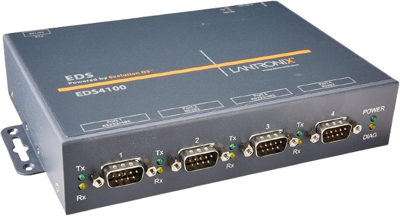

# 🛠️ Requisitos de Hardware y Software para la Integración de Balanzas Mettler Toledo

Este documento detalla los componentes esenciales de hardware y software necesarios para integrar la balanza analítica Mettler Toledo Newclassic MS con un sistema LIMS. Nuestro enfoque prioriza soluciones de **bajo costo** y **alta compatibilidad**, garantizando una implementación eficiente y accesible.

## ⚙️ 3. Requisitos para la Integración

Para establecer una comunicación fluida y automatizada entre la balanza Mettler Toledo Newclassic MS y el sistema LIMS, hemos identificado los siguientes requisitos mínimos. Estos han sido seleccionados pensando en la optimización de recursos y la facilidad de implementación.

### 3.1. Requisitos de Hardware

El objetivo primordial aquí es crear un puente robusto que conecte la balanza (a través de su puerto RS232C) con la red de su laboratorio. Para lograrlo, utilizaremos un dispositivo especializado que actuará como intermediario.

* **🌐 Servidor de Dispositivo Serie a Ethernet (Middleware / Convertidor RS232 a Ethernet):**
    * **Ejemplo:** Dispositivos líderes como **Lantronix (e.g., series EDS, UDS)**, Moxa, Digi, o alternativas genéricas de menor costo que ofrecen funcionalidad similar.
    * **Función Principal:** Este componente es crucial. Se conecta directamente al puerto RS232C de la balanza y se encarga de **transformar la comunicación serie digital en paquetes de red TCP/IP (Ethernet)**. Funciona como un *middleware de hardware*, haciendo que el puerto serie de la balanza sea accesible desde cualquier ordenador o servidor en su red local, como si estuviera conectado directamente.

    

        
    

    
    *Figura 1: Ejemplo de un servidor de dispositivo serie Lantronix EDS, un dispositivo clave para la conversión RS232 a Ethernet.*

    * **Consideraciones de Costo:** Aunque marcas como Lantronix son sinónimo de robustez y fiabilidad, sus costos pueden ser moderados. Existen opciones más económicas de otros fabricantes que cumplen la función básica de conversión serie a Ethernet. La elección final dependerá del presupuesto asignado y de los niveles de fiabilidad y soporte técnico requeridos.
    * **Conectividad:** Para su operación, este dispositivo requiere un **cable serie RS232** (comúnmente un cable DB9 macho-hembra, directo o null-modem según las especificaciones del manual de la balanza) y un **cable Ethernet** para la conexión a la red.

* **🔌 Cable Serie RS232 (DB9):**
    * **Descripción:** El conector físico esencial para unir la balanza con el servidor de dispositivo serie.
    * **Configuración:** La configuración específica (directo o null-modem) y el pinout exacto deben ser verificados directamente en el manual técnico de su modelo de balanza.
    * **Costo Estimado:** Aproximadamente **$5 -

### 3.2. Requisitos de Software

Una vez establecida la conexión física entre la balanza Mettler Toledo y la red mediante un conversor RS232 a Ethernet, es necesario contar con un **software que procese y dirija los datos generados** hacia el sistema LIMS correspondiente (por ejemplo, **LabWare**).

Este software puede ser desarrollado internamente o provisto por terceros, y su función principal es **cerrar el circuito de integración**, garantizando que cada medición sea interpretada, validada y enviada correctamente al LIMS.

#### Funciones que debe cumplir el software de integración:

* **Escuchar el puerto serie virtual** expuesto por el servidor RS232-Ethernet.
* **Leer, interpretar y validar** las tramas de datos emitidas por la balanza (habitualmente en formato texto, con separadores como CR/LF).
* **Asociar la medición** a un identificador de muestra, orden o código de lote proveniente del LIMS o de un escáner de código de barras.
* **Enviar la información al LIMS** utilizando la interfaz provista por el sistema (por ejemplo, una API RESTful en el caso de LabWare).
* **Registrar logs** de las operaciones realizadas, incluyendo fechas, datos transmitidos y confirmación de recepción por parte del LIMS, para fines de trazabilidad y auditoría.

> 💡 Este documento no provee el software de integración, pero **deja establecidas las condiciones técnicas necesarias para su desarrollo e implementación**, permitiendo que cualquier equipo técnico o proveedor pueda integrarse al sistema de forma ordenada, segura y eficiente.
