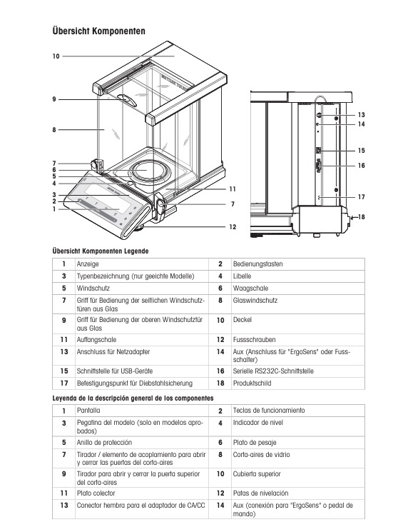

# Integración de Instrumentos Legacy de Laboratorio con LIMS (Low-Cost)

## 🧪 El Desafío de los Instrumentos Legacy en el Laboratorio Moderno

En muchos laboratorios, especialmente aquellos con una larga trayectoria como los de la industria farmacéutica, es común encontrar una mezcla de instrumentos modernos y equipos "legacy" que, a pesar de su antigüedad, siguen siendo perfectamente funcionales y precisos. Estos instrumentos, aunque fiables, a menudo carecen de la conectividad moderna necesaria para una integración directa y automatizada con los Sistemas de Gestión de Información de Laboratorio (LIMS).

La recolección manual de datos de estos equipos es un proceso propenso a errores humanos, consume tiempo valioso del personal y dificulta la trazabilidad y la eficiencia operativa. Sin embargo, la sustitución de todos los instrumentos legacy por modelos nuevos con conectividad integrada no siempre es económicamente viable.

## ⚖️ Escenario de Caso: La Balanza Analítica Mettler Toledo Newclassic MS

Para ilustrar esta problemática y proponer soluciones prácticas y de bajo costo, utilizaremos como ejemplo una balanza analítica Mettler Toledo de la serie Newclassic MS. Este tipo de balanza es un caballo de batalla en muchos laboratorios farmacéuticos, reconocida por su precisión y durabilidad.

A continuación, se muestra una vista general de un modelo típico de la serie Mettler Toledo Newclassic MS, destacando sus componentes y, crucialmente, sus opciones de conectividad:

### Conectividad de la Balanza: USB vs. RS232C

Como se observa en la Figura 1, la balanza Mettler Toledo Newclassic MS cuenta con dos interfaces de comunicación clave:

* **15: Interfaz USB para Dispositivos**
* **16: Interfaz Serie RS232C**

Si bien la interfaz USB ofrece una modernidad aparente, su implementación a menudo puede requerir controladores específicos o protocolos propietarios que aumenten la complejidad y, potencialmente, el costo de hardware o software.

Para mantener nuestro enfoque en una solución de **bajo costo y máxima compatibilidad** con la mayoría de los sistemas legacy, esta documentación se centrará principalmente en la **integración a través de la interfaz serie RS232C**. Esta opción es universalmente soportada, bien documentada y, por lo general, la más sencilla de implementar con herramientas y adaptadores económicos.

### Requisitos Esenciales para la Integración

Para llevar a cabo la integración de la balanza Mettler Toledo Newclassic MS utilizando la interfaz RS232C y enviar sus datos a un LIMS, es necesario cumplir con un conjunto de requisitos específicos de hardware y software.

Le invitamos a consultar la siguiente sección donde detallamos exhaustivamente estos elementos:

➡️ [**3. Requisitos para la Integración (Hardware y Software)**](docs/integration_requirements.md)

---

Este documento seguirá profundizando en cada uno de estos puntos, mostrando casos reales y ejemplos prácticos de integración con equipos específicos.
